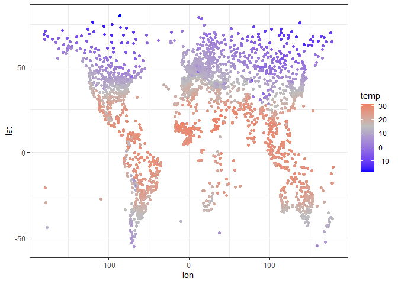
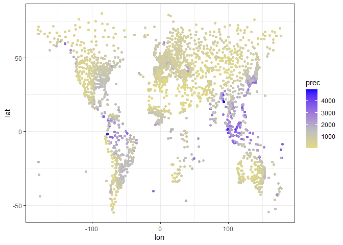
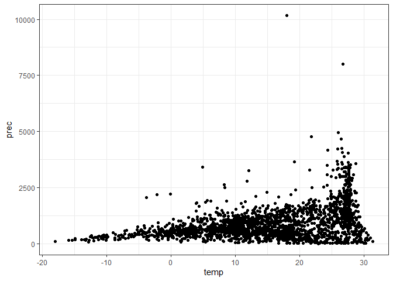
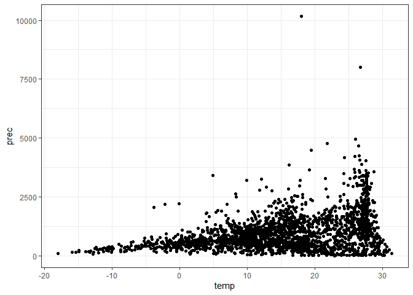
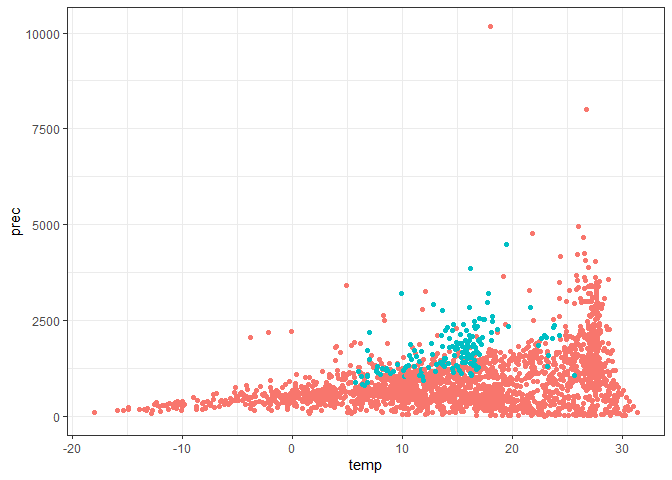

# clidatajp はじめに

<!-- badges: start -->
<!-- badges: end -->

The goal of clidatajp is to provide climate data from Japan
Meteorological Agency (‘JMA’). Data was downloaded from ‘JMA’ and
edited. You can also download climate data from ‘JMA’. However, I
strongly recomend you to use data(climate_world) and data(climate_jp)
when using mean temperature and precipitation.

clidatajpは，日本の気象庁(JMA)から取得した気候データを提供することを目的に開発しました．
データは，気象庁のページから取得して編集したものです．
また，気象庁から新たにデータをダウンロードすることも可能です．

## Installation インストール

You can install the development version of clidatajp from
[GitHub](https://github.com/matutosi/clidatajp). You can see climate
data directly from ‘JMA’ (
<https://www.data.jma.go.jp/gmd/cpd/monitor/nrmlist/> ).

開発中のバージョンは，GitHubからダウンロード可能です．

<https://github.com/matutosi/clidatajp>).

また，clidatajpを使わずとも，手作業で気象庁から直接データをダウンロードすることもできます．

<https://www.data.jma.go.jp/gmd/cpd/monitor/nrmlist/>

ただし，download_climate()や手作業で新たにデータを取得するには時間がかかります．
そのため，月平均気温と月間降水量については，data(climate_world) と
data(climate_jp)の使用をお勧めします．

``` r
  # CRAN
install.packages("clidatajp")

  # development
  # install.packages("devtools")
devtools::install_github("matutosi/clidatajp")
```

## Example 使用例

This is a basic example.

基本的な使い方は以下をご覧ください．

``` r
library(clidatajp)
library(magrittr)
library(dplyr)
#> 
#> Attaching package: 'dplyr'
#> The following objects are masked from 'package:stats':
#> 
#>     filter, lag
#> The following objects are masked from 'package:base':
#> 
#>     intersect, setdiff, setequal, union
library(tibble)
library(ggplot2)
library(stringi)


  # show station information and link
  # 観測地点とそのリンクのデータ
data(station_links)
station_links %>%
  dplyr::mutate("station" := stringi::stri_unescape_unicode(station))
#> # A tibble: 3,444 × 4
#>    no    station                                                  url    conti…¹
#>    <chr> <chr>                                                    <chr>  <chr>  
#>  1 60560 アインセフラ - アルジェリア   緯度：32.77°N   経度：0.6… https… "\\u30…
#>  2 60620 アドラル - アルジェリア   緯度：27.88°N   経度：0.18°W…  https… "\\u30…
#>  3 60369 アルジェ - アルジェリア   緯度：36.77°N   経度：3.10°E…  https… "\\u30…
#>  4 60360 アンナバ - アルジェリア   緯度：36.83°N   経度：7.82°E…  https… "\\u30…
#>  5 60611 イナメナス - アルジェリア   緯度：28.05°N   経度：9.63…  https… "\\u30…
#>  6 60640 イリジ - アルジェリア   緯度：26.50°N   経度：8.42°E  …  https… "\\u30…
#>  7 60690 インゲザム - アルジェリア   緯度：19.57°N   経度：5.77…  https… "\\u30…
#>  8 60630 インサラー - アルジェリア   緯度：27.23°N   経度：2.50…  https… "\\u30…
#>  9 60559 ウェド - アルジェリア   緯度：33.50°N   経度：6.78°E  …  https… "\\u30…
#> 10 60421 ウームエルブワギー - アルジェリア   緯度：35.87°N   経…  https… "\\u30…
#> # … with 3,434 more rows, and abbreviated variable name ¹​continent

  # show climate data
  # 観測データ(日本，世界)
data(japan_climate)
japan_climate %>%
  dplyr::mutate_if(is.character, stringi::stri_unescape_unicode)
#> # A tibble: 3,768 × 14
#>       no station month temperat…¹ preci…² snowf…³ insol…⁴ country period altit…⁵
#>    <dbl> <chr>   <dbl>      <dbl>   <dbl>   <dbl>   <dbl> <chr>   <chr>    <dbl>
#>  1 47401 稚内        1       -4.3    84.6     129    40.6 日本    1991-…     2.8
#>  2 47401 稚内        2       -4.3    60.6     105    74.7 日本    1991-…     2.8
#>  3 47401 稚内        3       -0.6    55.1      68   138.  日本    1991-…     2.8
#>  4 47401 稚内        4        4.5    50.3       9   174.  日本    1991-…     2.8
#>  5 47401 稚内        5        9.1    68.1       0   182.  日本    1991-…     2.8
#>  6 47401 稚内        6       13      65.8      NA   155.  日本    1991-…     2.8
#>  7 47401 稚内        7       17.2   101.       NA   143.  日本    1991-…     2.8
#>  8 47401 稚内        8       19.5   123.       NA   151.  日本    1991-…     2.8
#>  9 47401 稚内        9       17.2   137.       NA   172.  日本    1991-…     2.8
#> 10 47401 稚内       10       11.3   130.        1   135.  日本    1991-…     2.8
#> # … with 3,758 more rows, 4 more variables: latitude <dbl>, longitude <dbl>,
#> #   NS <chr>, WE <chr>, and abbreviated variable names ¹​temperature,
#> #   ²​precipitation, ³​snowfall, ⁴​insolation, ⁵​altitude

data(climate_world)
climate_world %>%
  dplyr::mutate_if(is.character, stringi::stri_unescape_unicode)
#> # A tibble: 41,328 × 12
#>       no continent country   station month tempe…¹ preci…² latit…³ NS    longi…⁴
#>    <dbl> <chr>     <chr>     <chr>   <dbl>   <dbl>   <dbl>   <dbl> <chr>   <dbl>
#>  1 60560 アフリカ  アルジェ… アイン…     1     7.1    14.9    32.8 N         0.6
#>  2 60560 アフリカ  アルジェ… アイン…     2     9.2    11.2    32.8 N         0.6
#>  3 60560 アフリカ  アルジェ… アイン…     3    12.9    15.9    32.8 N         0.6
#>  4 60560 アフリカ  アルジェ… アイン…     4    16.8    16.9    32.8 N         0.6
#>  5 60560 アフリカ  アルジェ… アイン…     5    21.5    15      32.8 N         0.6
#>  6 60560 アフリカ  アルジェ… アイン…     6    26.7     6.9    32.8 N         0.6
#>  7 60560 アフリカ  アルジェ… アイン…     7    31       4.1    32.8 N         0.6
#>  8 60560 アフリカ  アルジェ… アイン…     8    29.5    13.5    32.8 N         0.6
#>  9 60560 アフリカ  アルジェ… アイン…     9    24.4    21      32.8 N         0.6
#> 10 60560 アフリカ  アルジェ… アイン…    10    18.6    25.8    32.8 N         0.6
#> # … with 41,318 more rows, 2 more variables: WE <chr>, altitude <dbl>, and
#> #   abbreviated variable names ¹​temperature, ²​precipitation, ³​latitude,
#> #   ⁴​longitude

  # download climate data
  # 新たにデータを取得する場合
station_links %>%
  `$`("url") %>%
  `[[`(1) %>%
  download_climate()
#> # A tibble: 12 × 11
#>    station     country latit…¹ NS    longi…² WE    altit…³ month tempe…⁴ preci…⁵
#>    <chr>       <chr>   <chr>   <chr> <chr>   <chr> <chr>   <dbl>   <dbl>   <dbl>
#>  1 アインセフ… アルジ… 32.77   N     0.60    W     1058        1     7.1    14.9
#>  2 アインセフ… アルジ… 32.77   N     0.60    W     1058        2     9.2    11.2
#>  3 アインセフ… アルジ… 32.77   N     0.60    W     1058        3    12.9    15.9
#>  4 アインセフ… アルジ… 32.77   N     0.60    W     1058        4    16.8    16.9
#>  5 アインセフ… アルジ… 32.77   N     0.60    W     1058        5    21.5    15  
#>  6 アインセフ… アルジ… 32.77   N     0.60    W     1058        6    26.7     6.9
#>  7 アインセフ… アルジ… 32.77   N     0.60    W     1058        7    31       4.1
#>  8 アインセフ… アルジ… 32.77   N     0.60    W     1058        8    29.5    13.5
#>  9 アインセフ… アルジ… 32.77   N     0.60    W     1058        9    24.4    21  
#> 10 アインセフ… アルジ… 32.77   N     0.60    W     1058       10    18.6    25.8
#> 11 アインセフ… アルジ… 32.77   N     0.60    W     1058       11    12      22.3
#> 12 アインセフ… アルジ… 32.77   N     0.60    W     1058       12     8.2     9.4
#> # … with 1 more variable: url <chr>, and abbreviated variable names ¹​latitude,
#> #   ²​longitude, ³​altitude, ⁴​temperature, ⁵​precipitation
```

## Plot 図示

Clean up data before drawing plot.

図化前のデータ整理

    - 世界と日本のデータを結合   
    - 気温と降水量がNAの地点を除去   
    - 1991-2020の平年値を使用(日本)   
    - 緯度経度を整理   

``` r
climate <- 
  dplyr::bind_rows(climate_world, climate_jp) %>%
  dplyr::mutate_if(is.character, stringi::stri_unescape_unicode)  %>%
  dplyr::group_by(country, station) %>%
  dplyr::filter(sum(is.na(temperature), is.na(precipitation)) == 0) %>%
  dplyr::filter(period != "1991-2020" | is.na(period))

climate <- 
  climate %>%
  dplyr::summarise(temp = mean(as.numeric(temperature)), prec = sum(as.numeric(precipitation))) %>%
  dplyr::left_join(dplyr::distinct(dplyr::select(climate, station:altitude))) %>%
  dplyr::left_join(tibble::tibble(NS = c("S", "N"), ns = c(-1, 1))) %>%
  dplyr::left_join(tibble::tibble(WE = c("W", "E"), we = c(-1, 1))) %>%
  dplyr::group_by(station) %>%
  dplyr::mutate(lat = latitude * ns, lon = longitude * we)
#> `summarise()` has grouped output by 'country'. You can override using the
#> `.groups` argument.
#> Adding missing grouping variables: `country`
#> Joining with `by = join_by(country, station)`
#> Warning in dplyr::left_join(., dplyr::distinct(dplyr::select(climate, station:altitude))): Each row in `x` is expected to match at most 1 row in `y`.
#> ℹ Row 1 of `x` matches multiple rows.
#> ℹ If multiple matches are expected, set `multiple = "all"` to silence this
#>   warning.
#> Joining with `by = join_by(NS)`
#> Joining with `by = join_by(WE)`
```

Draw a world map with temperature.

年平均気温を世界地図のように表示．
ただし，緯度経度は単純な数値のため，正確ではない．

``` r
climate %>%
  ggplot(aes(lon, lat, colour = temp)) +
    scale_colour_gradient2(low = "blue", mid = "gray", high = "red", midpoint = 15) + 
    geom_point() + 
    theme_bw()
```



``` r
  # ggsave("temperature.png")
```

Draw a world map with precipitation except over 5000 mm/yr (to avoid
extended legend).

年間降水量を世界地図のように表示．
ただし，凡例が引きずられるのを防ぐため，5000mm/年 以上の地点は除去．

``` r
climate %>%
  dplyr::filter(prec < 5000) %>%
  ggplot(aes(lon, lat, colour = prec)) +
    scale_colour_gradient2(low = "yellow", mid = "gray", high = "blue", midpoint = 1500) + 
    geom_point() + 
    theme_bw()
```



``` r
  # ggsave("precipitation.png")
```

Show relationships between temperature and precipitation except Japan.

気温と降水量の関係(日本は除外)

``` r
japan <- stringi::stri_unescape_unicode("\\u65e5\\u672c")
climate %>%
  dplyr::filter(country != japan) %>%
  ggplot(aes(temp, prec)) + 
  geom_point() + 
  theme_bw() + 
  theme(legend.position="none")
```



``` r
  # ggsave("climate_nojp.png")
```

Show relationships between temperature and precipitation including
Japan.

気温と降水量の関係(日本を含む)

``` r
climate %>%
  ggplot(aes(temp, prec)) + 
    geom_point() + 
    theme_bw()
```



``` r
  # ggsave("climate_all.png")
```

Show relationships between temperature and precipitation. Blue: Japan,
red: others.

気温と降水量の関係(日本：水色，日本以外：赤色)

``` r
climate %>%
  dplyr::mutate(jp = (country == japan)) %>%
  ggplot(aes(temp, prec, colour = jp)) + 
    geom_point() + 
    theme_bw() +
    theme(legend.position="none")
```



``` r
  # ggsave("climate_compare_jp.png")
```

## Citation 引用

Toshikazu Matsumura (2022) Tools for download climate data from Japan
Meteorological Agency with R. <https://github.com/matutosi/clidatajp/>.

松村 俊和 (2022) Rを使った気象庁からの観測データの取得ツール.
<https://github.com/matutosi/clidatajp/> .
