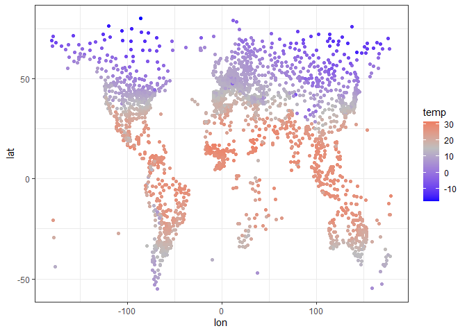
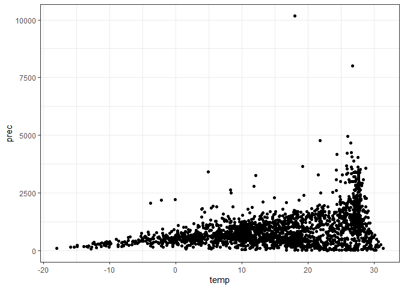

# clidatajp

<!-- badges: start -->
<!-- badges: end -->

clidatajpは，日本の気象庁(JMA)から取得した気候データを提供することを目的に開発しました．
データは，気象庁のページから取得して編集したものです．
また，気象庁から新たにデータをダウンロードすることも可能です．

## インストール

開発中のバージョンは，GitHubからダウンロード可能です．
また，clidatajpを使わずとも，手作業で気象庁から直接データをダウンロードすることもできます．

<https://www.data.jma.go.jp/gmd/cpd/monitor/nrmlist/>

``` r
  # CRAN
install.packages("clidatajp")

  # development
  # install.packages("devtools")
devtools::install_github("matutosi/clidatajp")
```

## 実行例

基本的な使い方は以下をご覧ください．

``` r
library(clidatajp)
library(tidyverse)
#> ── Attaching packages ─────────────────────────────────────── tidyverse 1.3.1 ──
#> ✔ ggplot2 3.3.6      ✔ purrr   0.3.4 
#> ✔ tibble  3.1.8      ✔ dplyr   1.0.10
#> ✔ tidyr   1.2.1      ✔ stringr 1.4.1 
#> ✔ readr   2.1.2      ✔ forcats 0.5.1
#> ── Conflicts ────────────────────────────────────────── tidyverse_conflicts() ──
#> ✖ dplyr::filter() masks stats::filter()
#> ✖ dplyr::lag()    masks stats::lag()

  # 観測地点とそのリンクのデータ
data(station_links)
station_links %>%
  dplyr::mutate("station" := stringi::stri_unescape_unicode(station))
#> # A tibble: 3,444 × 3
#>    no    station                                                         url    
#>    <chr> <chr>                                                           <chr>  
#>  1 1     アインセフラ - アルジェリア   緯度：32.77°N   経度：0.60°W   …  https:…
#>  2 2     アドラル - アルジェリア   緯度：27.88°N   経度：0.18°W   高度…  https:…
#>  3 3     アルジェ - アルジェリア   緯度：36.77°N   経度：3.10°E   高度…  https:…
#>  4 4     アンナバ - アルジェリア   緯度：36.83°N   経度：7.82°E   高度…  https:…
#>  5 5     イナメナス - アルジェリア   緯度：28.05°N   経度：9.63°E   高…  https:…
#>  6 6     イリジ - アルジェリア   緯度：26.50°N   経度：8.42°E   高度：5… https:…
#>  7 7     インゲザム - アルジェリア   緯度：19.57°N   経度：5.77°E   高…  https:…
#>  8 8     インサラー - アルジェリア   緯度：27.23°N   経度：2.50°E   高…  https:…
#>  9 9     ウェド - アルジェリア   緯度：33.50°N   経度：6.78°E   高度：6… https:…
#> 10 10    ウームエルブワギー - アルジェリア   緯度：35.87°N   経度：7.12… https:…
#> # … with 3,434 more rows

  # 観測データ(日本，世界)
data(japan_climate)
japan_climate %>%
  dplyr::mutate_if(is.character, stringi::stri_unescape_unicode)
#> # A tibble: 3,768 × 14
#>       no station month temperat…¹ preci…² snowf…³ insol…⁴ country period altit…⁵
#>    <dbl> <chr>   <dbl>      <dbl>   <dbl>   <dbl>   <dbl> <chr>   <chr>    <dbl>
#>  1 47401 稚内        1       -4.3    84.6     129    40.6 日本    1991-…     2.8
#>  2 47401 稚内        2       -4.3    60.6     105    74.7 日本    1991-…     2.8
#>  3 47401 稚内        3       -0.6    55.1      68   138.  日本    1991-…     2.8
#>  4 47401 稚内        4        4.5    50.3       9   174.  日本    1991-…     2.8
#>  5 47401 稚内        5        9.1    68.1       0   182.  日本    1991-…     2.8
#>  6 47401 稚内        6       13      65.8      NA   155.  日本    1991-…     2.8
#>  7 47401 稚内        7       17.2   101.       NA   143.  日本    1991-…     2.8
#>  8 47401 稚内        8       19.5   123.       NA   151.  日本    1991-…     2.8
#>  9 47401 稚内        9       17.2   137.       NA   172.  日本    1991-…     2.8
#> 10 47401 稚内       10       11.3   130.        1   135.  日本    1991-…     2.8
#> # … with 3,758 more rows, 4 more variables: latitude <dbl>, longitude <dbl>,
#> #   NS <chr>, WE <chr>, and abbreviated variable names ¹​temperature,
#> #   ²​precipitation, ³​snowfall, ⁴​insolation, ⁵​altitude

data(world_climate)
world_climate %>%
  dplyr::mutate_if(is.character, stringi::stri_unescape_unicode)
#> # A tibble: 41,328 × 11
#>       no month temperature precipi…¹ station country latit…² NS    longi…³ WE   
#>    <dbl> <dbl>       <dbl>     <dbl> <chr>   <chr>     <dbl> <chr>   <dbl> <chr>
#>  1     1     1         7.1      14.9 アイン… アルジ…    32.8 N         0.6 W    
#>  2     1     2         9.2      11.2 アイン… アルジ…    32.8 N         0.6 W    
#>  3     1     3        12.9      15.9 アイン… アルジ…    32.8 N         0.6 W    
#>  4     1     4        16.8      16.9 アイン… アルジ…    32.8 N         0.6 W    
#>  5     1     5        21.5      15   アイン… アルジ…    32.8 N         0.6 W    
#>  6     1     6        26.7       6.9 アイン… アルジ…    32.8 N         0.6 W    
#>  7     1     7        31         4.1 アイン… アルジ…    32.8 N         0.6 W    
#>  8     1     8        29.5      13.5 アイン… アルジ…    32.8 N         0.6 W    
#>  9     1     9        24.4      21   アイン… アルジ…    32.8 N         0.6 W    
#> 10     1    10        18.6      25.8 アイン… アルジ…    32.8 N         0.6 W    
#> # … with 41,318 more rows, 1 more variable: altitude <dbl>, and abbreviated
#> #   variable names ¹​precipitation, ²​latitude, ³​longitude

  # 新たにデータを取得する場合
station_links %>%
  `$`("url") %>%
  `[[`(1) %>%
  download_climate()
#> # A tibble: 12 × 11
#>    station     country latit…¹ NS    longi…² WE    altit…³ month tempe…⁴ preci…⁵
#>    <chr>       <chr>   <chr>   <chr> <chr>   <chr> <chr>   <dbl>   <dbl>   <dbl>
#>  1 アインセフ… アルジ… 32.77   N     0.60    W     1058        1     7.1    14.9
#>  2 アインセフ… アルジ… 32.77   N     0.60    W     1058        2     9.2    11.2
#>  3 アインセフ… アルジ… 32.77   N     0.60    W     1058        3    12.9    15.9
#>  4 アインセフ… アルジ… 32.77   N     0.60    W     1058        4    16.8    16.9
#>  5 アインセフ… アルジ… 32.77   N     0.60    W     1058        5    21.5    15  
#>  6 アインセフ… アルジ… 32.77   N     0.60    W     1058        6    26.7     6.9
#>  7 アインセフ… アルジ… 32.77   N     0.60    W     1058        7    31       4.1
#>  8 アインセフ… アルジ… 32.77   N     0.60    W     1058        8    29.5    13.5
#>  9 アインセフ… アルジ… 32.77   N     0.60    W     1058        9    24.4    21  
#> 10 アインセフ… アルジ… 32.77   N     0.60    W     1058       10    18.6    25.8
#> 11 アインセフ… アルジ… 32.77   N     0.60    W     1058       11    12      22.3
#> 12 アインセフ… アルジ… 32.77   N     0.60    W     1058       12     8.2     9.4
#> # … with 1 more variable: url <chr>, and abbreviated variable names ¹​latitude,
#> #   ²​longitude, ³​altitude, ⁴​temperature, ⁵​precipitation
```

## 図示

図化する前に，データの整理．

    - 世界と日本のデータを結合   
    - 気温と降水量がNAの地点を除去   
    - 1991-2020の平年値を使用(日本)   
    - 緯度経度を整理   

``` r
climate <- 
  dplyr::bind_rows(world_climate, japan_climate) %>%
  dplyr::mutate_if(is.character, stringi::stri_unescape_unicode)  %>%
  dplyr::group_by(station) %>%
  dplyr::filter(sum(is.na(temperature), is.na(precipitation)) == 0) %>%
  dplyr::filter(period != "1991-2020" | is.na(period))

climate <- 
  climate %>%
  dplyr::summarise(temp = mean(as.numeric(temperature)), prec = sum(as.numeric(precipitation))) %>%
  dplyr::left_join(dplyr::distinct(dplyr::select(climate, station:altitude))) %>%
  dplyr::left_join(tibble::tibble(NS = c("S", "N"), ns = c(-1, 1))) %>%
  dplyr::left_join(tibble::tibble(WE = c("W", "E"), we = c(-1, 1))) %>%
  dplyr::group_by(station) %>%
  dplyr::mutate(lat = latitude * ns, lon = longitude * we)
#> Joining, by = "station"
#> Joining, by = "NS"
#> Joining, by = "WE"
```

年平均気温を世界地図のように表示．
ただし，緯度経度は単純な数値のため，正確ではない．

``` r
climate %>%
  ggplot(aes(lon, lat, colour = temp)) +
    scale_colour_gradient2(low = "blue", mid = "gray", high = "red", midpoint = 15) + 
    geom_point() + 
    theme_bw()
```



``` r
  # ggsave("temperature.png")
```

年間降水量を世界地図のように表示．
ただし，凡例が引きずられるのを防ぐため，4000mm/年の地点は除去．

``` r
climate %>%
  dplyr::filter(prec < 4000) %>%
  ggplot(aes(lon, lat, colour = prec)) +
    scale_colour_gradient2(low = "yellow", mid = "gray", high = "blue", midpoint = 1500) + 
    geom_point() + 
    theme_bw()
```


``` r
  # ggsave("precipitation.png")
```

気温と降水量の関係(日本は除外)

``` r
japan <- stringi::stri_unescape_unicode("\\u65e5\\u672c")
climate %>%
  dplyr::filter(country != japan) %>%
  ggplot(aes(temp, prec)) + 
  geom_point() + 
  theme_bw() + 
  theme(legend.position="none")
```



``` r
  # ggsave("climate_nojp.png")
```

気温と降水量の関係(日本を含む)

``` r
climate %>%
  ggplot(aes(temp, prec)) + 
    geom_point() + 
    theme_bw()
```


``` r
  # ggsave("climate_all.png")
```

気温と降水量の関係(日本：水色，日本以外：赤色)

``` r
climate %>%
  dplyr::mutate(jp = (country == japan)) %>%
  ggplot(aes(temp, prec, colour = jp)) + 
    geom_point() + 
    theme_bw() +
    theme(legend.position="none")
```


``` r
  # ggsave("climate_compare_jp.png")
```

## 引用

Toshikazu Matsumura (2022) Tools for download climate data from Japan
Meteorological Agency with R. <https://github.com/matutosi/clidatajp/> .

松村 俊和 (2022) Rを使った気象協会からの観測データの取得ツール.
<https://github.com/matutosi/clidatajp/> .
