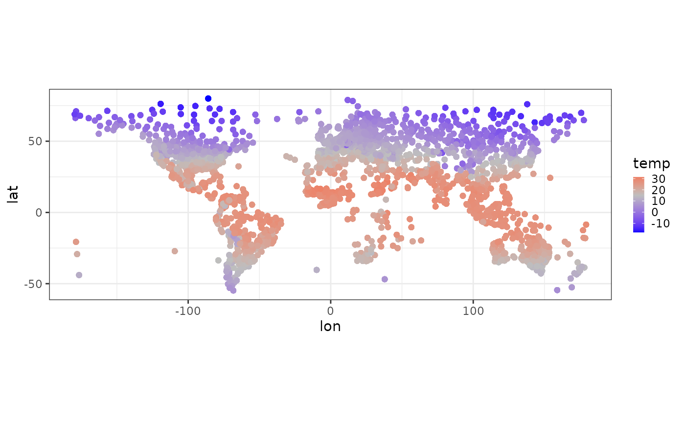
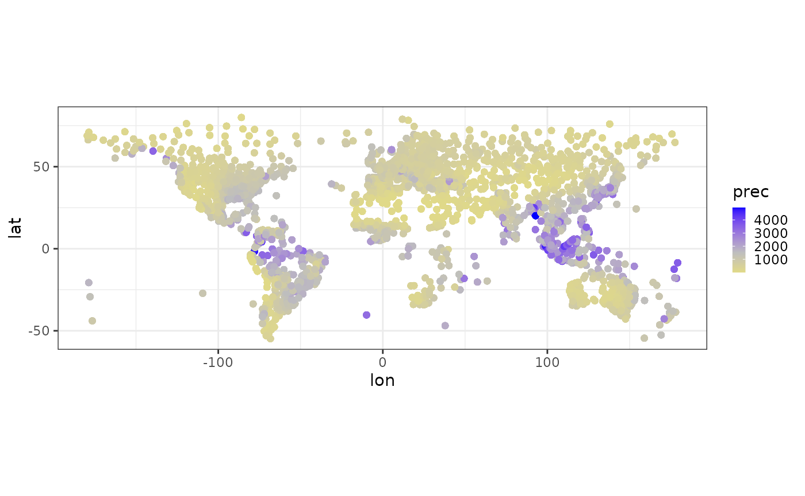
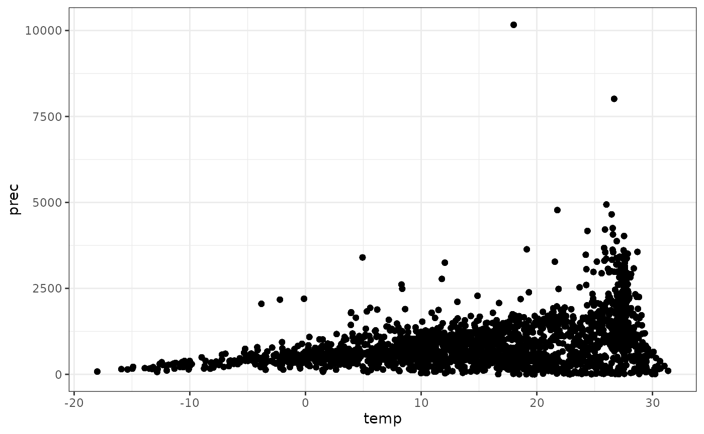
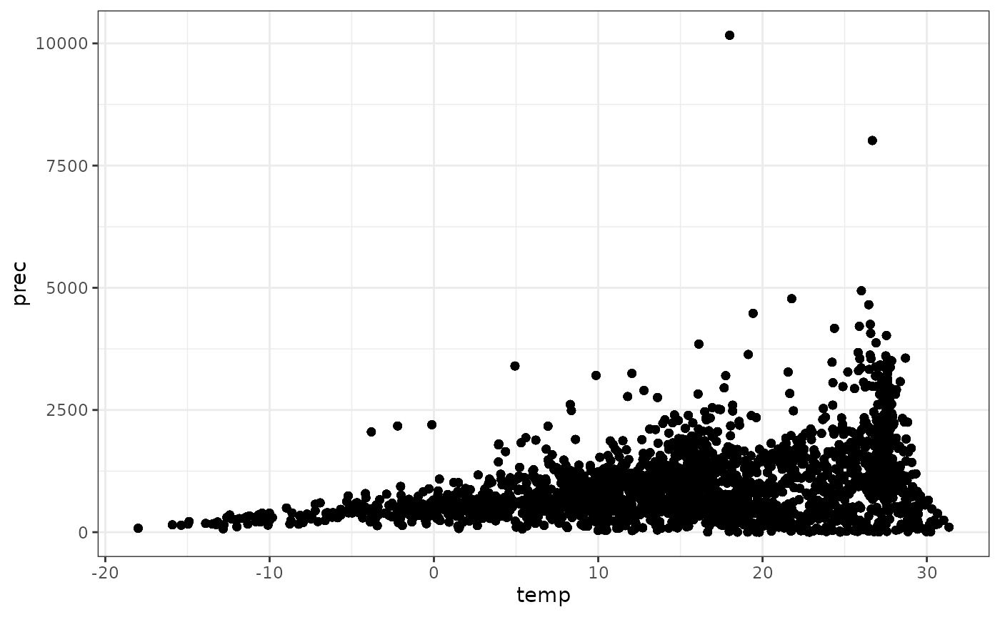
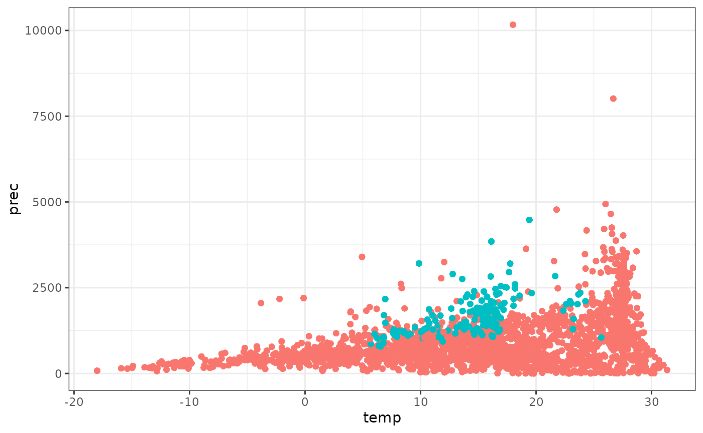

# clidatajp

## Japan Meteorological Agency (‘JMA’) web page

‘JMA’ web page consists of some layers. You can use different function
for download each component.

- Area select: download_area_links()
- Country select: download_links()
- Station select: download_links()
- Climate data of a station: download_climate()

## Links for climate data and station information

I recommend to use existing data, which are already downloaded and
cleaned up.

When you want to download links for climate data, use
download_area_links() and download_links(). download_area_links()
returns links for 6 areas. download_links() returns links for countries
and stations.

For polite scraping, 5 sec interval is set in download_links(), it takes
about 15 minutes to get all station links. Please use existing links by
“data(station_links)”, if you do not need to renew links.

``` r

library(clidatajp)
library(magrittr)
library(dplyr)
#> 
#> Attaching package: 'dplyr'
#> The following objects are masked from 'package:stats':
#> 
#>     filter, lag
#> The following objects are masked from 'package:base':
#> 
#>     intersect, setdiff, setequal, union
library(tibble)
library(ggplot2)
library(stringi)
```

``` r

  # existing data
data(station_links)
station_links %>%
  dplyr::mutate("station" := stringi::stri_unescape_unicode(station)) %>%
  print() %>%
  `$`("station") %>%
  clean_station() %>%
  dplyr::bind_cols(station_links["url"])

  # Download new data
  # If you want links for all countries and all sations, remove head().
url <- "https://www.data.jma.go.jp/gmd/cpd/monitor/nrmlist/"
res <- gracefully_fail(url)
if(!is.null(res)){
  area_links <- download_area_links()
  station_links <- NULL
  area_links <- head(area_links)  # for test
  for(i in seq_along(area_links)){
      print(stringr::str_c("area: ", i, " / ", length(area_links)))
      country_links <- download_links(area_links[i])
      country_links <- head(country_links)  # for test
      for(j in seq_along(country_links)){
          print(stringr::str_c("    country: ", j, " / ", length(country_links)))
          station_links <- c(station_links, download_links(country_links[j]))
      }
  }
  station_links <- tibble::tibble(url = station_links)
  station_links
}
```

## Climate data

I recommend to use existing data, which are already downloaded and
cleaned up.

When you want to know how to prepare “data(climate_jp)”, please check
url shown below.

<https://github.com/matutosi/clidatajp/blob/main/data-raw/climate_jp.R>

For polite scraping, 5 sec interval is set in download_climate(), it
takes over 5 hours to get world climate data of all stations because of
huge amount of data (3444 stations). Please use existing data by
“data(climate_world)”, if you do not need to renew climate data.

``` r

  # existing data
data(climate_jp)
climate_jp %>%
  dplyr::mutate_if(is.character, stringi::stri_unescape_unicode)

data(climate_world)
climate_world %>%
  dplyr::mutate_if(is.character, stringi::stri_unescape_unicode)

  # Download new data
  # If you want links for all countries and all sations, remove head().
url <- "https://www.data.jma.go.jp/gmd/cpd/monitor/nrmlist/"
res <- gracefully_fail(url)
if(!is.null(res)){
  station_links <-
    station_links %>%
    head() %>%
    `$`("url")
  climate <- list()
  for(i in seq_along(station_links)){
    print(stringr::str_c(i, " / ", length(station_links)))
    climate[[i]] <- download_climate(station_links[i])
  }
  world_climate <- dplyr::bind_rows(climate)
  world_climate
}
```

### Plot

Clean up data before drawing plot.

``` r

data(climate_world)
data(climate_jp)
climate <- 
  dplyr::bind_rows(climate_world, climate_jp) %>%
  dplyr::mutate_if(is.character, stringi::stri_unescape_unicode)  %>%
  dplyr::group_by(country, station) %>%
  dplyr::filter(sum(is.na(temperature), is.na(precipitation)) == 0) %>%
  dplyr::filter(period != "1991-2020" | is.na(period))

climate <- 
  climate %>%
  dplyr::summarise(temp = mean(as.numeric(temperature)), prec = sum(as.numeric(precipitation))) %>%
  dplyr::left_join(dplyr::distinct(dplyr::select(climate, station:altitude))) %>%
  dplyr::left_join(tibble::tibble(NS = c("S", "N"), ns = c(-1, 1))) %>%
  dplyr::left_join(tibble::tibble(WE = c("W", "E"), we = c(-1, 1))) %>%
  dplyr::group_by(station) %>%
  dplyr::mutate(lat = latitude * ns, lon = longitude * we)
#> `summarise()` has regrouped the output.
#> Adding missing grouping variables: `country`
#> Joining with `by = join_by(country, station)`
#> Joining with `by = join_by(NS)`
#> Joining with `by = join_by(WE)`
#> ℹ Summaries were computed grouped by country and station.
#> ℹ Output is grouped by country.
#> ℹ Use `summarise(.groups = "drop_last")` to silence this message.
#> ℹ Use `summarise(.by = c(country, station))` for per-operation grouping
#>   (`?dplyr::dplyr_by`) instead.
```

Draw a world map with temperature.

``` r

climate %>%
  ggplot2::ggplot(aes(lon, lat, colour = temp)) +
    scale_colour_gradient2(low = "blue", mid = "gray", high = "red", midpoint = 15) + 
    geom_point() + 
    coord_fixed() + 
    theme_bw() + 
    theme(legend.key.size = unit(0.3, 'cm'))
```



``` r

    # ggsave("temperature.png")
```

Draw a world map with precipitation except over 5000 mm/yr (to avoid
extended legend).

``` r

climate %>%
  dplyr::filter(prec < 5000) %>%
  ggplot2::ggplot(aes(lon, lat, colour = prec)) +
    scale_colour_gradient2(low = "yellow", mid = "gray", high = "blue", midpoint = 1500) + 
    geom_point() + 
    coord_fixed() + 
    theme_bw() + 
    theme(legend.key.size = unit(0.3, 'cm'))
```



``` r

  # ggsave("precipitation.png")
```

Show relationships between temperature and precipitation except Japan.

``` r

japan <- stringi::stri_unescape_unicode("\\u65e5\\u672c")
climate %>%
  dplyr::filter(country != japan) %>%
  ggplot2::ggplot(aes(temp, prec)) + 
  geom_point() + 
  theme_bw() + 
  theme(legend.position="none")
```



``` r

  # ggsave("climate_nojp.png")
```

Show relationships between temperature and precipitation including
Japan.

``` r

climate %>%
  ggplot2::ggplot(aes(temp, prec)) + 
    geom_point() + 
    theme_bw()
```



``` r

  # ggsave("climate_all.png")
```

Show relationships between temperature and precipitation. Blue: Japan,
red: others.

``` r

climate %>%
  dplyr::mutate(jp = (country == japan)) %>%
  ggplot2::ggplot(aes(temp, prec, colour = jp)) + 
    geom_point() + 
    theme_bw() +
    theme(legend.position="none")
```



``` r

  # ggsave("climate_compare_jp.png")
```
